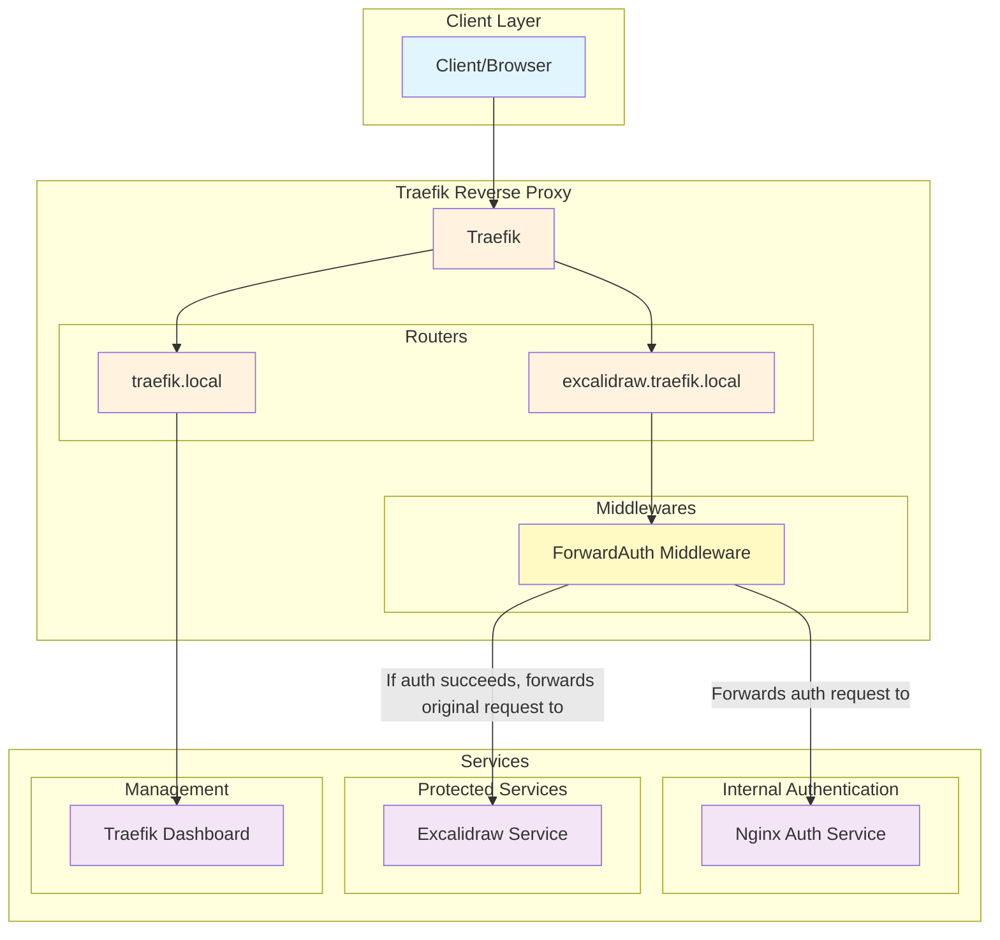
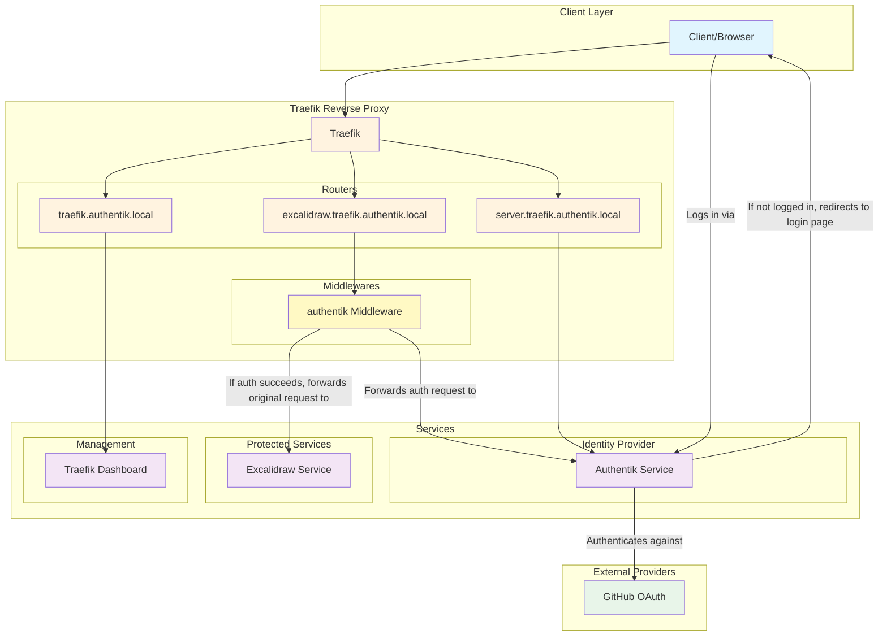

# Traefik ForwardAuth Examples

This project provides examples of different authentication setups using Traefik's ForwardAuth middleware.

## Overview

Forward authentication is a powerful feature in Traefik that delegates authentication decisions to an external service. This allows for flexible and robust authentication mechanisms without building them into your own services.

All setups in this repository share a common architecture:
- **Traefik** acts as the gateway and reverse proxy.
- **Excalidraw** is used as an example service that requires authentication/SSO before it can be accessed.
- A **third-party service** (like Nginx or Authentik) provides **external authentication**.

This repository includes the following examples:

- [Nginx HTTP Basic Authentication](./nginx)
- Authentik (Coming Soon)

## 1. Nginx HTTP Basic Authentication

This example demonstrates a simple and effective authentication setup using an Nginx service providing HTTP Basic Authentication.

The setup includes:
- **Traefik** as a reverse proxy and load balancer.
- **Nginx** as a lightweight, internal authentication service.
- **Excalidraw** as an example protected service.
- A straightforward authentication flow where Traefik uses Nginx to protect a service with a username and password.

### System Components

For more details on the Nginx example, see the [Nginx README](./nginx/README.md).

## 2. Authentik with GitHub OAuth2

This example demonstrates a comprehensive authentication solution using Authentik, a flexible open-source Identity Provider that supports SSO and social login.

The setup includes:
- **Traefik** as a reverse proxy and load balancer.
- **Authentik** as a feature-rich identity provider supporting SSO and social login (e.g., GitHub, Google, etc.).
- **Excalidraw** as an example service protected by Authentik.
- A sophisticated authentication flow where users can log in using social providers like GitHub, and Traefik uses Authentik's embedded outpost to protect services.

### System Components

For more details on the Authentik example, see the [Authentik README](./authentik/README.md).

