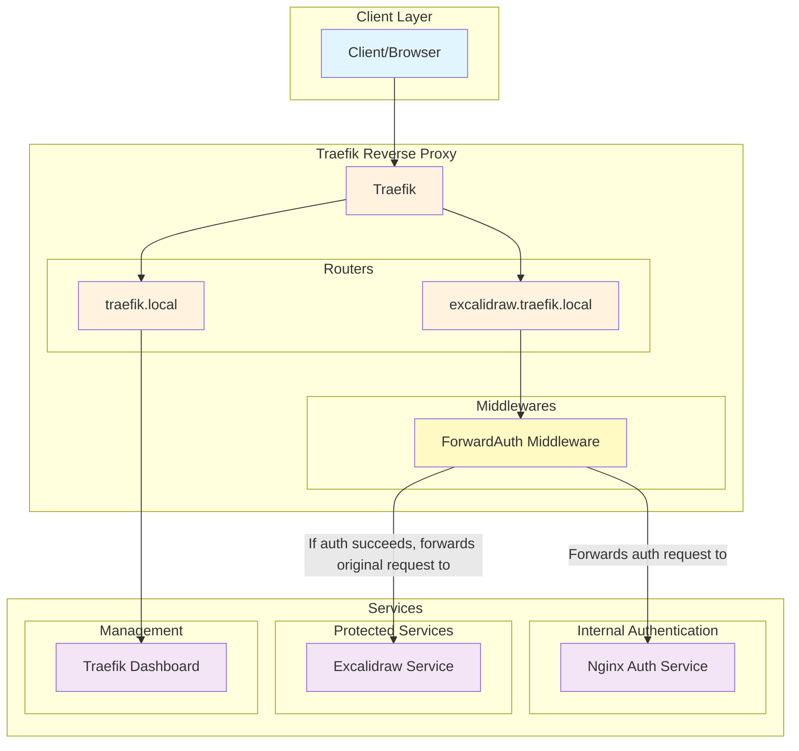
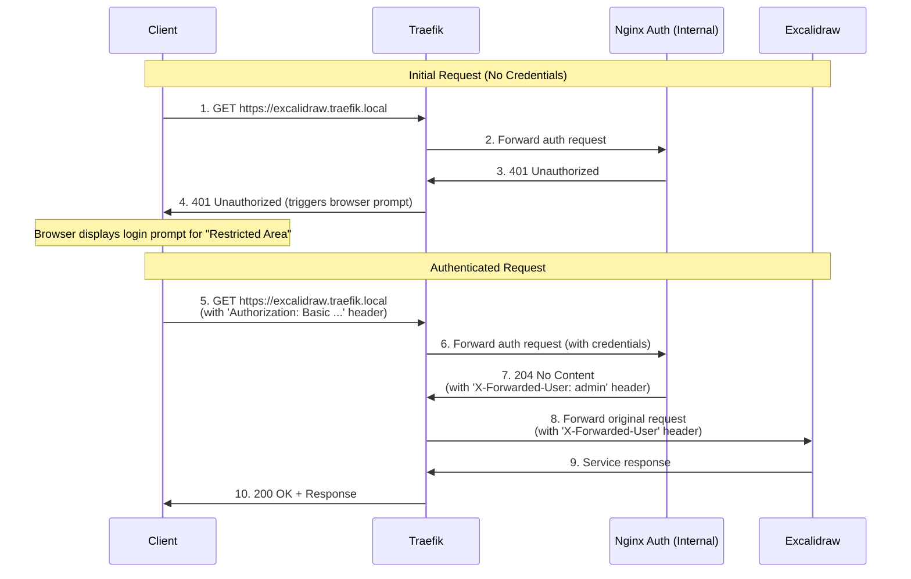
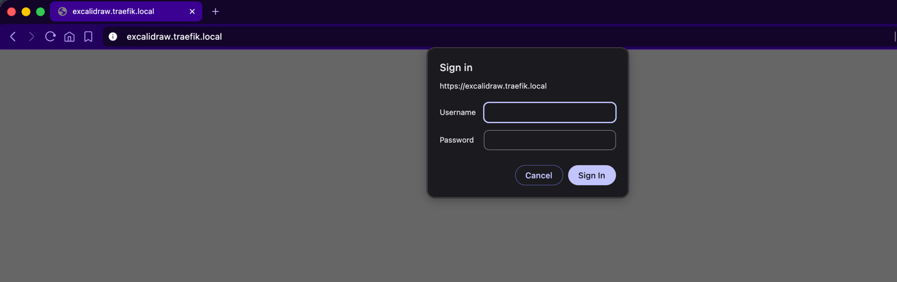
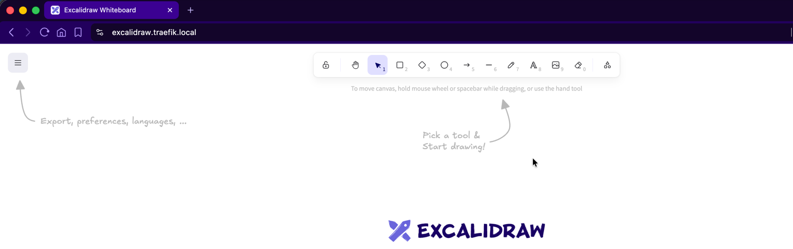

# Traefik ForwardAuth with Nginx HTTP Basic Authentication

This project demonstrates a simple and effective authentication setup using Traefik's ForwardAuth middleware with an Nginx service providing HTTP Basic Authentication.

## Overview

The setup includes:
- **Traefik** as a reverse proxy and load balancer.
- **Nginx** as a lightweight, internal authentication service.
- **Excalidraw** as an example protected service.
- A straightforward authentication flow where Traefik uses Nginx to protect a service with a username and password.

## Architecture

### System Components



### Request Flow Sequence



### Flow Explanation

1.  **Initial Request**: The client makes a request to the protected service (`excalidraw.traefik.local`).
2.  **ForwardAuth**: Traefik intercepts the request and, because of the `nginx-auth` middleware, sends an authentication request to the internal `nginx-auth` service.
3.  **Authentication Challenge**: Since the initial request has no credentials, the Nginx service returns a `401 Unauthorized` response. Traefik forwards this to the client, causing the browser to display a username/password prompt.
4.  **Authenticated Request**: The user enters their credentials (`admin`/`admin`). The browser sends the request again, this time with an `Authorization: Basic <credentials>` header.
5.  **Validation**: Traefik again forwards the auth request to Nginx. Nginx validates the credentials against its configured `.htpasswd` file.
6.  **Success and Forward**: Upon successful validation, Nginx returns a `204 No Content` status and adds the `X-Forwarded-User` header. Traefik receives this successful response and forwards the original client request to the `excalidraw` service, along with the `X-Forwarded-User` header.
7.  **Final Response**: The `excalidraw` service responds, and Traefik passes the response back to the client.

## User Experience

1. **Login Required**: When first accessing the site, the browser will prompt for credentials.


2. **Authentication**: Enter the username and password (`admin`/`admin`).


3. **Access Granted**: After successful authentication, the user can access the protected Excalidraw service.


## Services

### 1. Traefik (Reverse Proxy)
- **URL**: `https://traefik.local`
- **Purpose**: The main reverse proxy and dashboard. It manages incoming traffic and coordinates with the authentication service.

### 2. Nginx Auth Service
- **Purpose**: Provides HTTP Basic Authentication internally for Traefik. It has no public URL. It validates credentials and returns a success or failure status to Traefik.
- **Credentials**: The user is `admin` with password `admin`, as configured in `compose.yml`.

### 3. Excalidraw Service (Protected)
- **URL**: `https://excalidraw.traefik.local`
- **Purpose**: An example service that is protected by the `nginx-auth` middleware. Access is only granted after successful authentication.

## Quick Start

1.  **Start the services:**
    ```bash
    docker compose up -d
    ```

2.  **Access the protected service:**
    Open your browser and navigate to `https://excalidraw.traefik.local`. You will be prompted for a username and password.

    Alternatively, use `curl`:
    ```bash
    # This will fail with a 401
    curl https://excalidraw.traefik.local -k

    # This will succeed
    curl -u admin:admin https://excalidraw.traefik.local -k
    ```
    The `-u admin:admin` flag tells curl to use HTTP Basic Authentication.
